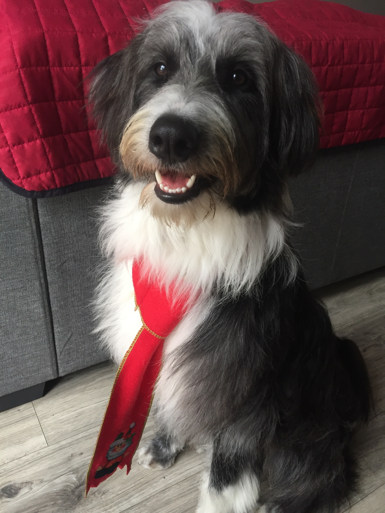
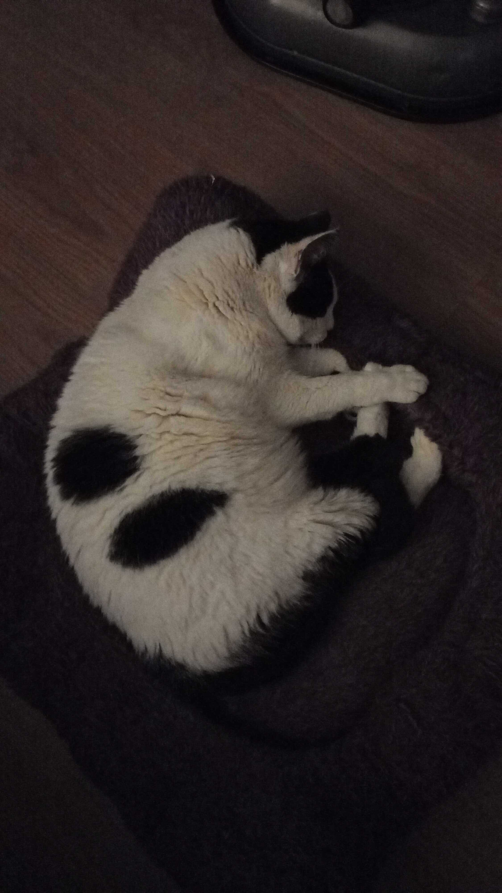
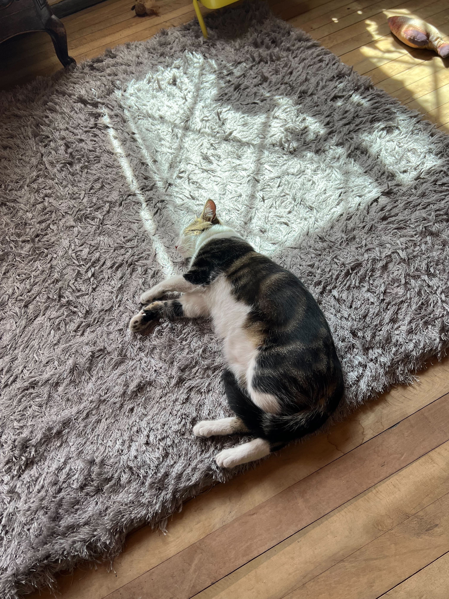

# Petblr

* [¿Qué es Petblr?](#1-¿qué-es-petblr)
* [Resumen del proyecto](#2-resumen-del-proyecto)
* [Consideraciones generales](#3-consideraciones-generales)
* [Definición del producto](#4-definición-del-producto)
* [Historias de usuario](#5-historias-de-usuario)
* [Diseño de la Interfaz de Usuario (prototipo de baja fidelidad y de alta fidelidad)](#6-diseño-de-la-interfaz-de-usuario-prototipo-de-baja-fidelidad-y-de-alta-fidelidad)
* [Autoras](#7-autoras)
* [Agradecimientos especiales](#8-agradecimientos-especiales)

## 1. ¿Qué es Petblr?
Es una red social pensada para todos los amantes de los animales, en PETBLR podrás crear un perfil para uno de los miembros más especiales de tu familia. Queremos que la atención sea sólo para ellos.
En PETBLR queremos formar una comunidad entorno a las mascotas, dónde podamos compartir por medio de post información relevante, recomendaciones y demás que ayuden y faciliten la interacción de los dueños de nuestros usuarios.
Queremos tener un muy buen alcance, por  lo anterior hemos pensado en que nuestros usuarios puedan ingresar a PETBLR con cuentas de correo electrónico y facebook. 

## 2. Resumen del proyecto

En este proyecto construimos una Red Social pensada para los amantes de las mascotas, para esto:
- Desarrollamos una SPA que cuenta con los conceptos de responsividad en el desarrollo de las vistas (templates).
- Implementamos un router para la navegación entre las diferentes vistas de la aplicación.
- Empleamos un servicio externo (Firebase) para la persistencia de datos de la aplicación.
- Creamos, implementamos y probamos pruebas unitarias que permiten testear código asíncrono.
 
## 3. Consideraciones generales

* En este proyecto trabajamos 3 personas, las cuales estuvimos comprometidas con el aprendizaje grupal e individual. Se estableció un ambiente de trabajo ameno, en el cuál pudimos compartir ideas, conocimientos, logros y retos

* La lógica del proyecto fue implementada completamente en JavaScript, HTML y CSS . Para este proyecto no utilizamos frameworks o librerías de CSS y JS.

* La división y organización del trabajo nos permitió, sin excepciones, que cada una de las personas que formamos el equipo practicaramos el aprendizaje de todo lo involucrado en cada historia de usuario. Nos propusimos como reto salir de la zona de confort, investigar, plantear, y aplicar código juntas.

* Trabajamos en una única historia por vez, aún con los retos que se nos presentaron cumplimos a punto con esa meta y lo implementamos

### 4. Definición del producto

Nuestra aplicación es para los dueños de mascotas que quieren tener un lugar en el cual compartir el día a día de su mascota pero no desde su cuenta personal, si no que desde una cuenta de la mascota.
Nuestros principales usuarios, como lo mencionamos, son los dueños de mascotas que quieran compartir la rutina de sus mascotas.
Petblr entrega una interfaz en la cual ls mascotas pueden publicar sus pensamientos para compartirlos con la comunidad. Además, pueden darle me gusta a las publicaciones de las otras mascotas.

### 5. Historias de usuario

##### HU 1 - Yo como dueño de mascotas quiero ingresar a una red social para interactuar con otros dueños de mascotas.

###### CRITERIOS DE ACEPTACIÓN

###### * Que el usuario se pueda registrar con un formulario
###### * Tenga la opción de registrar con correo
###### * Tenga la opción de registrar con Facebook
###### DEFINICION DE TERMINADO

###### * Investigar, ensayar y aplicar la información
###### * Feedback
###### * Tiene tests
###### * Deploy
###### * Subir código
###### * Validar correo
###### * Solo aceptar un correo por cuenta
###### * Que la contraseña cumpla con: mínimo 6 carácteres, mínimo una mayúscula y un número.
###### * input de contraseña debe ser secreto
###### * fiel al prototipo
###### * SPA
###### * Router
###### * responsive

##### H2 - Yo como usuaria de PETBLR quiero poder iniciar sesión para ver las publicaciones y/o conocer otros usuarios

###### CRITERIOS DE ACEPTACIÓN
###### * Puedo ingresar con correo, contraseña y/o cuenta de Facebook.

###### DEFINICION DE TERMINADO
###### * SPA
###### * Botón para recuperar la contraseña/usuario
###### * Cumple con los parámetros definidos para la contraseña
###### * Mostrarle al usuario si se está equivocando en algún lado.
###### * validar usuarios/contraseñas con la data guardada
###### * la contraseña cumple con los parámetros anteriormente mencionados
###### * mostrar dónde falta/falla la data entregada
###### * Feedback
###### * Tiene tests
###### * Deploy
###### * Subir código

##### HU 3 - Yo como usuario de Petblr quiero poder publicar un post para compartir el día de mi mascota.

###### CRITERIOS DE ACEPTACIÓN
###### * Puedo escribir una publicación

###### DEFINICION DE TERMINADO
###### * botón con la opción de escribir post
###### * input en el cual escribir la publicación (máx. 1000 carácteres)
###### * botón de publicación
###### * input se transforma en tarjeta
###### * SPA
###### * responsive
###### * Mantener logueado al usuario
###### * Feedback
###### * Deploy
###### * Subir código

##### HU 4 - Yo como usuario de Petblr quiero poder editar mi post y tener la opción de borrarlo por si me arrepiento de lo publicado.

###### CRITERIOS DE ACEPTACIÓN
###### * puedo editar, guardar y eliminar mi post

###### DEFINICION DE TERMINADO
###### * botón de editar
###### * la tarjeta se transforma en input
###### * botón de eliminar
###### * botón de cancelar
###### * botón de guardar
###### * SPA
###### * responsive
###### * Feedback
###### * Tiene tests
###### * Deploy
###### * Subir código

##### HU 5 -Yo como usuario de Petblr quiero poder ver las publicaciones de los demás para poder ver quienes están en la aplicación

###### CRITERIOS DE ACEPTACIÓN
###### * Puedo ver las publicaciones de otros usuarios.
###### * Puedo ver mis publicaciones.

###### DEFINICION DE TERMINADO
###### * botón de ir a home
###### * scroll
###### * visualización posts de toda la comunidad
###### * SPA
###### * responsive
###### * Mantener logueado al usuario
###### * Feedback
###### * Tiene tests
###### * Deploy
###### * Subir código

##### HU 6 - Yo como usuario de Petblr quiero poder darle me gusta a las publicaciones de los demás para ir creando una comunidad.

###### CRITERIOS DE ACEPTACIÓN
###### * Tengo la opción de dar me gusta a las publicaciones

###### DEFINICION DE TERMINADO
###### * solo acepta un like por cuenta
###### * puede quitar el like al dar click en la huella por segunda vez
###### * prototipo
###### * botón huella para dar like y quitar like
###### * SPA
###### * responsive
###### * Mantener logueado al usuario
###### * Feedback
###### * Tiene tests
###### * Deploy
###### * Subir código

### 6. Diseño de la Interfaz de Usuario (prototipo de baja fidelidad y de alta fidelidad)

Colores
- `snowWhite `  `#ffffff`
- `lightIvory `  `#F8EDE4`
- `dogBrown `  `#563c2e`
- `palePink `  `#dcc5b6`
- `lightPink `  `#d7a799`
- `redCollar `  `#a91918`
- `blue `  `#086680`
- `chocolate `  `#492319`
- `fallOrange `  `#a24c33`
- `fairIvory `  `#F7DFD3`
- `ivory `  `#dfcfab`
- `pigPink `  `#e5a5a4`
- `cherryRed `  `#901921`
- `black `  `#000000`

Tipografía
- Arial

Diseño de baja fidelidad

Diseño de alta fidelidad

### 7. Autoras

- [@filletournesols](https://github.com/filletournesols)
- [@vickymendoza](https://github.com/vickymendoza)
- [@fff3r](https://github.com/fff3r)

### 8. Agradecimientos especiales

* Rudolph, gerente general

* Cuchis bb, directora de comunicaciones

* Enriqueta Marraqueta, supervisora de proyecto
